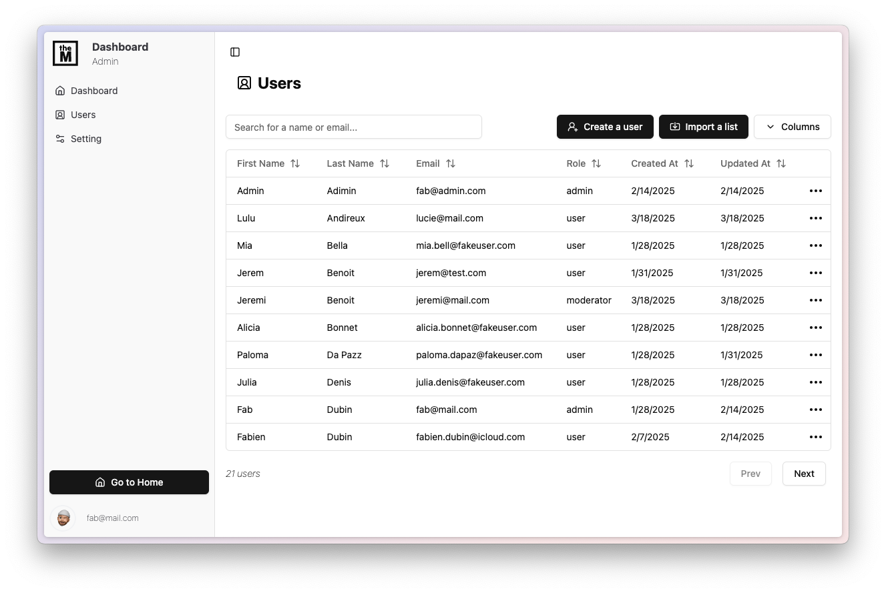

# MERN App Template

This is a simple React, Express, and MongoDB application template that you can use as a starting point for your own projects.

## Technical Stack

<p align="center">
	<a href="https://skillicons.dev">
		
	</a></p>

- ⚡ **Vite**: A popular JavaScript library for building user interfaces.
- 🌐 **Express**: A Node.js framework for building web applications.
- 🗄️ **MongoDB**: A NoSQL database for storing data.
- 🦠 **Mongoose**: An Object Data Modeling (ODM) library for MongoDB that provides a straightforward way to interact with the database.
- ⚡ **Axios**: A promise-based HTTP client for making requests to the server.
- 🏃‍♂️ **React Router**: A routing library for React applications.
- 🛠️ **ShadCN**: A popular CSS framework for building responsive web applications.
- 🎨 **TailwindCSS**: A popular CSS framework for building responsive web applications.
- 🐳 **Docker**: An open-source platform for developing, shipping, and running applications inside containers.

## Features

- **API Endpoints**: You can access various endpoints using Axios using services. Each service corresponds to a resource in your backend (e.g., users, products). Create a new file under the src/services directory for each resource, for example: UserService.js.
- **Authentication**: User authentication is handled using JWT tokens.
- **IsPrivate Component**:Wrapper to protect pages and redirects to the login page.
- **IsAnonymous Component**: Wrapper that makes the page accessible only for non-authenticated users.
- **IsAdmin Component**: Wrapper that makes the dashboard accessible only for admin users. Admins can be defined before registration via the .env file of the server or after creation via the admin dashboard.
- **Routing**: React Router is used for routing between different pages.
- **ReCAPTCHA**: It verifies that the user is human and avoid bot intrusion.
- **Mailjet Integration**: Mailling service to send notifications to the user (basically set on the password recovery)

## Middlewares

- **JWT Token Generation**: A middleware that generates a JSON Web Token (JWT) for user authentication.
- **Role-Based Access Control**: A middleware that checks the user's role and allows access to certain resources based on their role.
- **Rate Limiting**: A middleware that limits the number of post requests per IP. You can apply this to all requests
- **Cloudinary**: A middleware that manages the updload of the profile images using Cloudinary. It should be migrated to a dedicated server on production. You can get API key, secret and name via Cloudinary dashboard

## Pages

Here id the list of the available pages. This is a starter pack to be customized on the specificities of your project.

### Sign up 📝

The signup page creates a new user. It integrates a reCAPTCHA verification to limit bot intrusion.

<div style="text-align: center;">
    
</div>

### Login 🔑

Just a classic login page with a reset password button.

<div style="text-align: center;">
    
</div>

### Home 🏠

A classic home page that needs to be customized according to your project

<div style="text-align: center;">
    
</div>

### Profile 👤

The profile page of the user. Basically, the user can update its informations. Regarding the password, a button triggers a reset password email (WIP)

<div style="text-align: center;">
    
</div>

### Dashboard 📊

The dashboard is only accessible for the users with the "Admin" role.
Set the default admins to the server .env file to get the user role set to admin for the defined users when they register.

- **Main page** : Some example of dataviz. It needs to be plugged to the relevant data
- **User Management** : This table allows the admin to manage the registered users, create new ones and bulk import via copy-paste from Excel
- **Dashboard - Settings** : To be defined but the page is ready feel free to customize it
<div style="text-align: center;">
<div style="display: flex; justify-content: space-around;">
    
    
</div>
</div>

### NotFound 🚀

The not found page is displayed when the url doesn't exist

### NotAuthorized 🔒

This page is displayed when a user tries to go to a page that is not allowed. For example, when a normal user want to go to the dashboard.

## Tests

This project includes a test suite using **Jest** and **Testing Library** (client side) and **Supertest** (server side).

### ✅ Backend Tests

- **`auth.test.js`**: Tests login/signup/logout behavior and token generation.
- **`middleware.test.js`**: Tests route protections like `isAuthenticated` and `isAdmin`.
- **`user.test.js`**: Tests user-related CRUD operations and permissions.
- **`admin-role-env.test.js`**: Ensures users listed in the `ADMINS` env variable are assigned the admin role on creation.

### ✅ Frontend Tests

- **`AdminAuthFlow.test.jsx`**: Tests that an admin can sign up and access the dashboard (protected by `IsAdmin`, `IsPrivate`).
- **`AuthContext.test.jsx`**: Tests authentication context logic (login, logout).
- **`Login.test.jsx` / `SignUp.test.jsx`**: Simulates user interactions with the login and signup forms.

To run all tests:

```bash
npm run test
```

## Contributing

Want to contribute? Awesome! ✨

To get started:

1. Fork this repository.
2. Create a new branch (`git checkout -b feature/yourFeatureName`).
3. Commit your changes (`git commit -am 'Add some feature'`).
4. Push to the branch (`git push origin feature/yourFeatureName`).
5. Create a new Pull Request.

Please make sure your code passes the tests and follows the existing coding style. Add test coverage for new features if relevant.

## Installation

1. Clone this repository to your local machine.
2. Install the dependencies by running `npm install` in the client and the server folders
3. Set the environment variables in `.env` file for the client AND the server AND the root folder

### Basic settings on server side

> ```
> PORT=5005
> ORIGIN=http://localhost:5173
> TOKEN_SECRET=*** #Define a tocken secret for JWT token generation
> APP_NAME=MERN-App-Template #Kebab case please
>
> #MONGO
> MONGODB_USER=*** #Please change this
> MONGODB_PASSWORD=*** #Please change this
> MONGODB_URI=mongodb://127.0.0.1:27017/MERN-App-Template
>
> #AdminUser
> ADMINS=[Array of emails] #all emails is this array will get the role set to Admin when they register
>
> #Cloudinary config (to enable the profile image upaload)
> CLOUDINARY_API_KEY=**_ #Paste your Cloudinary api key
> CLOUDINARY_API_SECRET= _** #Paste your Cloudinary api key
> CLOUDINARY_NAME=*** #Paste here your cloudinary cloud name
>
> #ReCAPTCHA
> RECAPTCHA_SECRET_KEY=*** #Paste here your ReCAPTCHA Secret Key from Google admin console
>
> #MailJet
> MAILJET_API_KEY=*** #Paste the Mailjet API key
> MAILJET_SECRET_KEY=*** #Paste the Mailjet SECRET key
> MAILJET_SENDER=[Sender Email]
> MAILJET_NAME=[Sender name]
> ```

### Basic settings on client side

> ```
> VITE_API_URL=http://localhost:5005
>
> #Default profile image when a new user is created from SignUp page or Admin Dashboard
> VITE_FALLBACK_IMG=https://avatars.githubusercontent.com/u/104376512?v=4 //default profile image
>
> #Default password when the admin creates a new user from the dashboard
> VITE_DEFAULT_PASS=Test123 #Set the password of your choice the matches auth route requirement (min 6 chars, 1 number, one lowercase one uppercase)
>
> #ReCAPTCHA
> VITE_RECAPTCHA_SITE_KEY=*** #Paste here your ReCAPTCHA Site Key from Google admin console
> ```

### Basic settings on the root folder for the docker-compose

> ```
> MONGO_INITDB_ROOT_USERNAME=fab
> MONGO_INITDB_ROOT_PASSWORD=Test123
> MONGOEXPRESS_BASIC_AUTH_USERNAME=fab
> MONGOEXPRESS_BASIC_AUTH_PASSWORD=Test123
> ```

## List the dependencies

### Server (server/package.json)

- axios: For making HTTP requests.
- bcryptjs: For hashing passwords.
- cloudinary: For media storage and management.
- cookie-parser: For parsing cookies from the browser.
- cors: For handling CORS (Cross-Origin Resource Sharing).
- dotenv: For loading environment variables from a .env file.
- express: The web framework for Node.js.
- express-jwt: JWT middleware for Express.
- express-rate-limit: To limit the rate of incoming requests.
- jsonwebtoken: For generating and verifying JWT tokens.
- mongoose: An ODM (Object Data Modeling) tool for MongoDB.
- morgan: HTTP request logger middleware.
- multer: Middleware for handling multipart/form-data, primarily used for uploading files.
- multer-storage-cloudinary: Storage for Multer using Cloudinary.
- node-mailjet: For sending emails via Mailjet.

### Client (client/package.json)

- @radix-ui/react-\* : A collection of accessible and reusable UI components.
- @tanstack/react-table: A library for creating interactive tables in React.
- axios: For making HTTP requests.
- class-variance-authority: For managing dynamic CSS classes in TypeScript.
- clsx: A utility for combining class names in JavaScript.
- lodash: A JavaScript library for manipulating and handling data.
- lucide-react: React SVG icons.
- react and react-dom: The main libraries of React.
- react-google-recaptcha: To integrate Google reCAPTCHA into a React application.
- applications.
- recharts: A library for creating charts and data visualizations in React.
- tailwind-merge and tailwindcss-animate: Tools to enhance animations with Tailwind CSS.

### Development Dependencies:

- @eslint/js: For ESLint.
- @types/\*: TypeScript types for React, Node.js, etc.
- autoprefixer: A CSS preprocessor that adds necessary prefixes to CSS properties.
- eslint and plugins: For linting JavaScript/TypeScript code.
- globals: Global variable definitions for ESLint.
- postcss: A framework for processing CSS.
- tailwindcss: The Tailwind CSS framework.
- vite: A fast and modern build tool.
- vite-plugin-svgr: Vite plugin to import SVG files as React components.

## Next features

Here is a list of the next features I would like to add :

- [x] **`Mailjet integration`**: <strike>Adding reset password with Mailjet.</strike>
- [x] **`Auto admin role assignation`**: <strike>Check on the server side to add the admin role on a defined list of users.</strike>
- [x] **`Bulk import`**: <strike>Import user list via copy paste.</strike>
- [x] **`Dockerize the app`**: <strike>Write the docker compose for server deployment.</strike>
- [ ] **`Add proxy`**: Add a proxy to expose the app to the internet.
- [x] **`Add unit tests`**: <strike>Add unit tests for all middlewares and controllers on the server side and .</strike>

I hope you find this project useful! If you would like to contribute, please feel free to clone the repo and submit a pull request. I am also open to feature requests or sharing ideas on how to improve the project.

- **License**: MIT License

Happy coding ❤️
